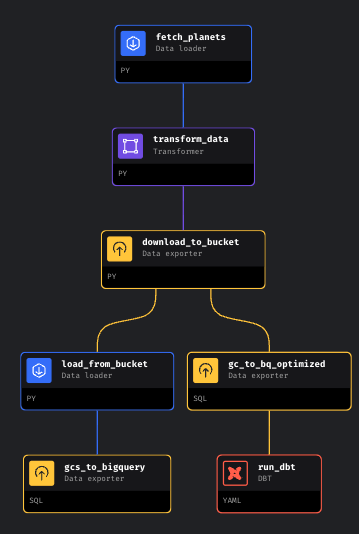

# Exoplanets | Final project for Data Engineering Zoomcap 2024

This repository contains the code and materials for the final project of the Data Engineering Zoomcamp  in the 2024 Cohort. 

The project focuses on building an end-to-end data pipeline from [NASA's exoplanet archive](https://exoplanetarchive.ipac.caltech.edu/index.html) all the way up to the datasets that feed the final [dashboard](https://lookerstudio.google.com/reporting/48002710-b1bd-42cf-b4a2-61cc555a3f8c):

<table><tr>
<td>  </td>
<td>  </td>
 <td>  </td>
</tr>
<tr>
<td>Mage Pipeline DAG</td>
<td>DBT model lineage Graph</td>
<td>Looker Dashboard</td>
</tr></table>

## Project description

### Problem description

Space is always something that has fascinated me. More recently I have been an avid follower of the [Astrum](https://www.youtube.com/@astrumspace) youtube channel where the creator exposes several exciting astronomy topics for non-astroscientist. While watching the videos, I have also felt the need to have a more structured notion about what exactly what we know and don't know about the universe, in particular the planets outside our solar system (exoplanets). Luckily I've found [NASA's exoplanet archive](https://exoplanetarchive.ipac.caltech.edu/index.html) in the dataset lists for the Data Engineering Zoomcamp and decided to navigate thru the data to understand:
* Exactly how many planets have we discovered so far
* How have we discovered them and what are the most relevant techniques
* From all the planets that we have found, which ones could be potentially habitable taking into account:
  * The distance to their host star and whether they fall into what astronomers call the goldilock zone which could sustain materials such as water or methane at liquid temperatures
  * The estimated surface gravity - as we know if the gravity is too high or too low our bodies would collapse.

There are of course many other factors to take into account before packing and move into another exoplanet (radiation, atmosphere composition, planet constitution whether solid or gas, etc), but let's bear with just these for the purpose of the exercise.

NOTE: I don't have any background in astronomy or astrophysic - so if you are a professional scientist reading this, please allow for some gross simplfications, this is just a Data Engineering project :wink:

### Pipeline description
#### Tech Stack
* Cloud: **Google Cloud Platform**
  * Data Lake: **Google Cloud Storage**
  * Data Warehouse: **BigQuery**
* Infrastructure as Code (IaC): **Terraform**
* Data ingestion (Batch/Workflow Orchestration): **Mage**
* Data Transformation: **dbt**
* Data Visualization: **Looker Studio**

#### Project Structure
The project has been structured with the following folders and files:
* `mage`: Workflow orchestration pipeline
* `dbt`: Data transformation logic
* `looker`: Report from Looker Studio
* `terraform`: IaC stream-based pipeline infrastructure in GCP using Terraform
* `images`: Printouts of results

#### High level overview:
* Pipeline fetches selected data [columns](https://exoplanetarchive.ipac.caltech.edu/docs/API_PS_columns.html) from the data from NASA's [API](https://exoplanetarchive.ipac.caltech.edu/docs/TAP/usingTAP.html#PS)
* Then it transforms data set (date fields) and uploads them to Google Cloud Storage.
* It then proceeds on to creating optimized (via clustering and partioning) and non-optimized raw versions of the data in the DataWarehouse.
* Once the data is in BigQuery, several steps are perfomed using dbt (including generating ids, calculating some parameters like gravity surface) to have the final clean dataset again in BigQuery ready for visualization.

## Project Setup
### Prerequisites
1. [Docker](https://docs.docker.com/engine/install/)
2. [Git](https://git-scm.com/book/en/v2/Getting-Started-Installing-Git)
3. [Terraform](https://developer.hashicorp.com/terraform/install)
4. Setup a GCP account

Before running the code you need to follow the steps below.

#### Setting up GCP
Google Cloud is a suite of Cloud Computing services offered by Google that provides various services like compute, storage, networking, and many more. It is organised into Regions and Zones.

Setting up GCP would require a GCP account. A GCP account can be created for free on trial but would still require a credit card to signup.

1. Start by creating a GCP account at [this link](https://cloud.google.com/)
2. Navigate to the GCP Console and create a new project. Give the project an appropriate name and take note of the project ID.
3. Create a service account:
   - In the left sidebar, click on "IAM & Admin" and then click on "Service accounts."
   - Click the "Create service account" button at the top of the page.
   - Enter a name for your service account and a description (optional).
   - Select the roles you want to grant to the service account. For this project, select the BigQuery Admin and Storage Admin.
   - Click "Create" to create the service account.
   - After you've created the service account, you need to download its private key file. This key file will be used to authenticate requests to GCP services.
   - Click on the service account you just created to view its details.
   - Click on the "Keys" tab and then click the "Add Key" button.
   - Select the "JSON" key type and click "Create" to download the private key file. This key would be used to interact to the google API from Mage.
   - Store the json key as you please, but then copy it into the `mage` directory of this project  and
give it exactly the name `keys.json`.

### Executing the code

*Note: these instructions are used for macOS/Linux/WSL, for Windows it may differ*

1. Clone this repository
```bash
git clone https://github.com/gdumie01/dezc2024-proj-exoplanets.git
```
2. Enter its root directory:
```bash
cd dezc2024-proj-exoplanets
```
#### Running Terraform

3. Edit terraform **variables.tf** file.
You need to change the variable `project` to the id of your GCP project and the bucket name `data-lake-bucket` to something that doesn't clash with existing buckets (e.g.: add 1 to the end)


My resources are created for region **EU**. If needed, you can change it in **variables.tf** file - make sure you change it accordingly in the following steps, specially in dbt.

4. Prepare working directory for following commands:
```bash
terraform init
```
5. Check execution plan:
```bash
terraform plan
```
6. Create the infrastructure:
```bash
terraform apply
```
When you are done with the project, you can release all resources by running `terraform destroy`.

#### Executing Mage Pipeline
7. Rename `dev.env` to simply `.env`.
8. Build the Mage containter
```bash
docker compose build
```
9. Start the Docker container:
```bash
docker compose up
```
10. Once the docker container is running navigate to (http://localhost:6789) in your browser
11. Time to work with mage. Go to the browser, find **pipelines**, click on `nasa_exoplanets_to_gcs` pipeline and click on Run@once. 

<table><tr>
<td>  </td>
<td>  </td>
<td>  </td>
<tr>
<td>Find pipeline</td>
<td>Pipeline </td>
<td>Run pipeline </td>
</tr>
</tr></table>

After it runs, you will have:
* A parquet file in the datalake
* the `dw_exo_planets` dataset in BigQuery with the following tables and views:


## Visualizing the results
I have publishing the following [dashboard](https://lookerstudio.google.com/reporting/48002710-b1bd-42cf-b4a2-61cc555a3f8c) to exhibit the results of the final datasets.


Key insights for me were:
* 2013 and 2016 really helped on the advancement of our knowledge about exoplanets - 40% of all know planets were discovered in those years.
* Instruments in space are key to help us discover new planets, although since 2016 ground facilities have also seen their contribution weight increase on the discovery of new planets
* Transit is by far the most used discovery method technique
* Despite all this, for 77% of the discovered planets we are missing key information that would enable us to understand where they are located within their solar systems and their mass which could help us understand what type of planets they are

**In conclusion**: despite the rapid recent advacements of science, we are still a long way to be sure about habitability of exoplanets by humans.

## Evaluation Criteria

I aimed to hit the following evaluation criteria:
- :white_check_mark: **Problem description**: Hope the contents of this readme are enough to understand my motivations and the problem I was trying to address with this project.
- :white_check_mark: **Cloud**: The project is developed on the cloud (Google) and IaC tools (Terraform) are used for provisioning the infrastructure.
- :white_check_mark: **Data Ingestion**: Fully deployed workflow orchestration using Mage.
- :white_check_mark: **Data warehouse**: Tables are created in BigQuery and optimized for the upstream queries based on clustering and partition (see comments in the code).
- :white_check_mark: **Transformations**: Tables are transformed using dbt, including calculation of surface gravity and computation of planet type according to some rules.
- :white_check_mark: **Dashboard**: 2 tiles were created - one linked to distribution of the data across a temporal line (evolution of planet discoveries) and another with categories generated based on planet's data.
- :white_check_mark: **Reproducibility**: Hopefully it works when you follow the instructions :smile:.
